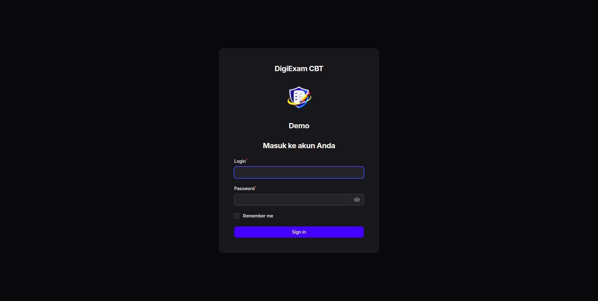
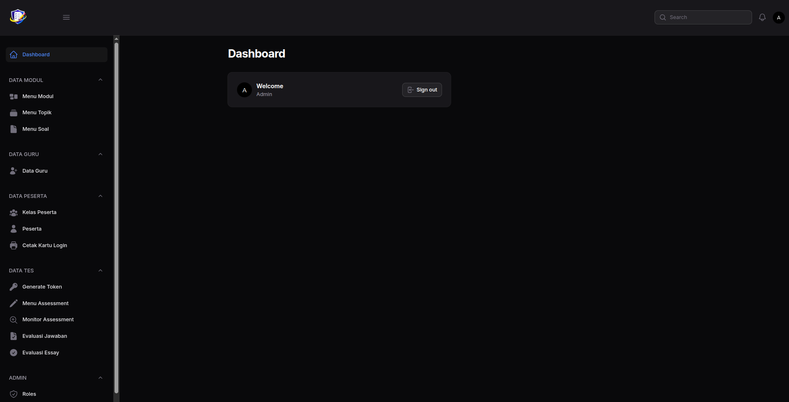
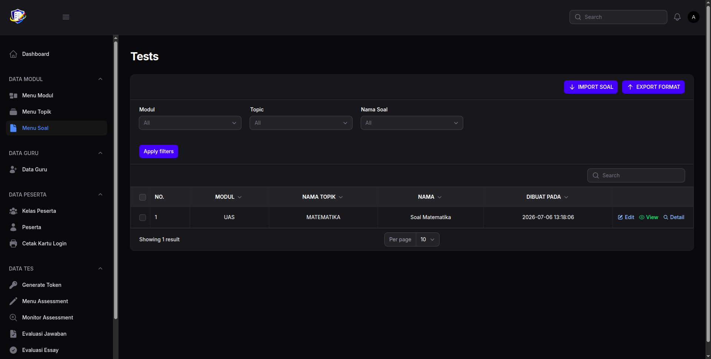
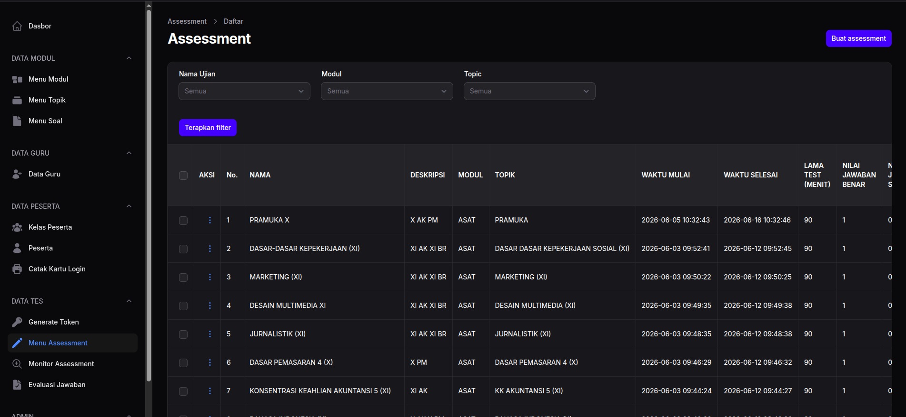
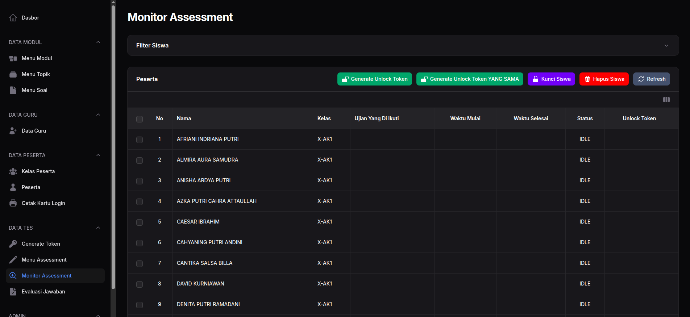
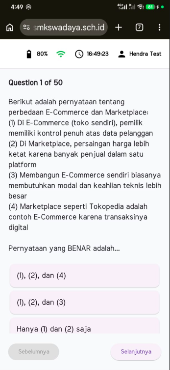
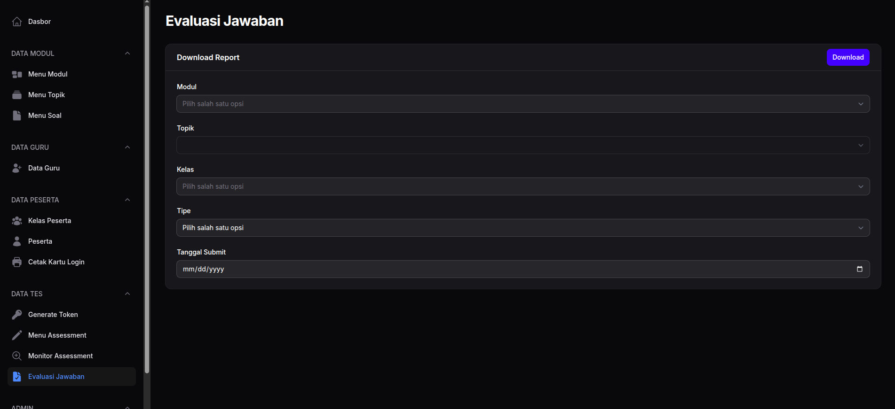
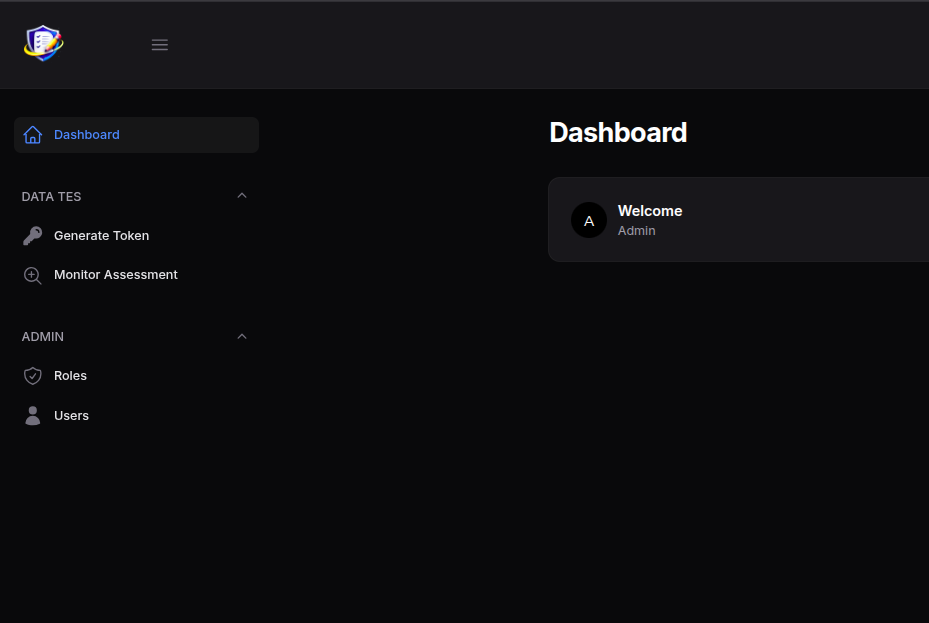
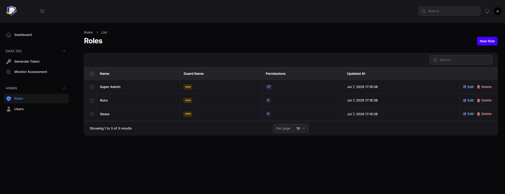
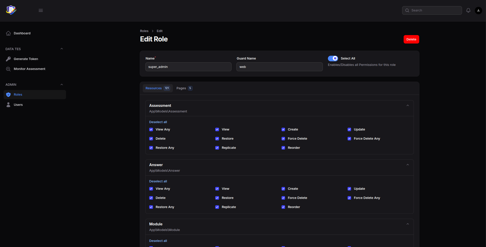

# DigiExam

<div align="center">

A modern web-based student assessment platform built with **Laravel**, **Filament**, and **Flutter**.

Platform asesmen siswa modern berbasis **Laravel**, **Filament**, dan **Flutter**.


</div>

---

# 🇮🇩 Bahasa Indonesia

## Tentang DigiExam

DigiExam adalah platform asesmen siswa berbasis web yang dirancang untuk membantu sekolah dalam mengelola ujian secara digital. Aplikasi ini menyediakan panel administrasi modern, bank soal, pelaksanaan ujian berbasis token, penilaian otomatis, serta pelaporan hasil ujian.

Repository ini merupakan versi **demo** yang dibuat untuk keperluan portfolio dan demonstrasi. Seluruh logo, data, dan identitas institusi telah diganti menggunakan data contoh.

---

## Fitur

- Login Administrator
- Dashboard
- Manajemen Guru
- Manajemen Siswa
- Manajemen Kelas
- Manajemen Mata Pelajaran
- Bank Soal
- Token Ujian
- Pelaksanaan Ujian
- Penilaian Otomatis
- Dashboard Hasil
- REST API
- Mobile Application (Flutter)

---

## Teknologi

### Backend

- Laravel 12
- Filament v5
- PHP 8.4

### Frontend

- Flutter
- Blade
- Vite

### Database

- SQLite (Demo)

### Server

- Docker
- Caddy
- PHP-FPM

---

## Screenshots

| Login | Dashboard |
|-------|-----------|
|  |  |

| Question Bank | Assessment | Monitor Assessment |
|---------------|------------|--------------------|
|  |  |  |

| Mobile App | Result |
|------------|--------|
|  |  |

```
assets/
├── login.png
├── dashboard.png
├── assessment.png
└── result.png
```

---

## Instalasi

Clone repository

```bash
git clone git@github.com:risyalf/digiexam-demo.git

cd digiexam-demo
```

Install dependency

```bash
composer install

npm install
```

Copy environment

```bash
cp .env.example .env
```

Generate application key

```bash
php artisan key:generate
```

Buat database SQLite

```bash
touch database/database.sqlite
```

Migrasi dan seeder

```bash
php artisan migrate --seed
```

Daftarkan Shield

```bash
php artisan shield:install
```

Generate Shield

```bash
php artisan shield:generate
```

Build asset

```bash
npm run build
```

Jalankan aplikasi

```bash
composer dev
```

## After Instalasi



Pergi Ke Menu Roles



Edit Role Super Admin



Pilih Select All, Save Changes

---

## Docker

```bash
docker compose up -d --build

docker compose exec app php artisan migrate --seed --force
```

---

## 👥 Kontribusi

Risyal Febrianto (@risyalf)
Andy Wijaya (@andywijaya15)

Proyek ini dikembangkan secara kolaboratif oleh dua orang.

| Area | Kontribusi |
|------|------------|
| Backend | Saya dengan dukungan rekan tim |
| Aplikasi Flutter | Dikembangkan oleh saya |
| Filament CMS | Saya dengan dukungan rekan tim |
| Desain Database | Dirancang oleh saya |
| REST API | Saya |
| Docker & Infrastruktur | Rekan tim |
| CI/CD | Rekan tim |
| Deployment Server | Rekan tim |
| Monitoring (Grafana) | Rekan tim |

## Disclaimer

Versi ini merupakan aplikasi demo untuk portfolio.

Seluruh data, logo, gambar, dan identitas institusi telah diganti menggunakan data contoh.

---

---

## Troubleshooting

### SQLite: `attempt to write a readonly database`

Jika muncul error seperti berikut:

```text
SQLSTATE[HY000]: General error: 8 attempt to write a readonly database
```

Pastikan file database SQLite beserta folder `database` memiliki permission yang benar.

```bash
sudo chown -R www-data:www-data database
sudo chmod -R 775 database
```

Atau jika menjalankan menggunakan user selain `www-data`, sesuaikan owner dengan user web server yang digunakan.

Pastikan file berikut dapat ditulis:

```
database/database.sqlite
```

Anda dapat memverifikasi permission dengan:

```bash
ls -lah database
```

Setelah permission diperbaiki, restart web server atau PHP-FPM jika diperlukan.

---

# 🇺🇸 English

## About

DigiExam is a modern web-based student assessment platform designed to help educational institutions manage digital examinations efficiently.

This repository is a **portfolio demonstration** version. All branding, logos, and institutional data have been replaced with sample assets.

---

## Features

- Authentication
- Admin Dashboard
- Teacher Management
- Student Management
- Class Management
- Subject Management
- Question Bank
- Exam Token
- Online Examination
- Automatic Scoring
- Result Dashboard
- REST API
- Flutter Mobile Application

---

## Tech Stack

### Backend

- Laravel 12
- Filament v5
- PHP 8.4

### Frontend

- Flutter
- Blade
- Vite

### Database

- SQLite

### Infrastructure

- Docker
- Caddy
- PHP-FPM

---

## Installation

Clone repository

```bash
git clone git@github.com:risyalf/digiexam-demo.git

cd digiexam-demo
```

Install dependencies

```bash
composer install

npm install
```

Create environment

```bash
cp .env.example .env
```

Generate application key

```bash
php artisan key:generate
```

Create SQLite database

```bash
touch database/database.sqlite
```

Run migrations

```bash
php artisan migrate --seed
```

Build frontend assets

```bash
npm run build
```

Start development server

```bash
composer dev
```

---

## Docker

```bash
docker compose up -d --build

docker compose exec app php artisan migrate --seed --force
```

---

## Project Structure

```
app/
bootstrap/
config/
database/
public/
resources/
routes/
storage/
```

---

## Future Improvements

- Multi School Support
- Computer Based Test
- Question Randomization
- Real-time Monitoring
- AI Assisted Question Generator
- Analytics Dashboard

---

## Troubleshooting

### SQLite: `attempt to write a readonly database`

If you encounter the following error:

```text
SQLSTATE[HY000]: General error: 8 attempt to write a readonly database
```

Make sure both the SQLite database file and the `database` directory have the correct permissions.

```bash
sudo chown -R www-data:www-data database
sudo chmod -R 775 database
```

If your web server runs under a different user, replace `www-data` with the appropriate user.

Also, ensure that the following file is writable:

```
database/database.sqlite
```

You can verify the permissions by running:

```bash
ls -lah database
```

If the issue persists, ensure that the parent `database` directory is also writable, as SQLite needs to create temporary journal (`-journal`, `-wal`, or `-shm`) files during write operations.

After updating the permissions, restart your web server or PHP-FPM (if applicable).

---

## License

This project is released under the MIT License.

---

## Author

**Risyal**

Backend Developer • Flutter Developer

GitHub

https://github.com/risyalf

LinkedIn

https://www.linkedin.com/in/risyal-febrianto/

Portfolio

https://porto.risyal.web.id/